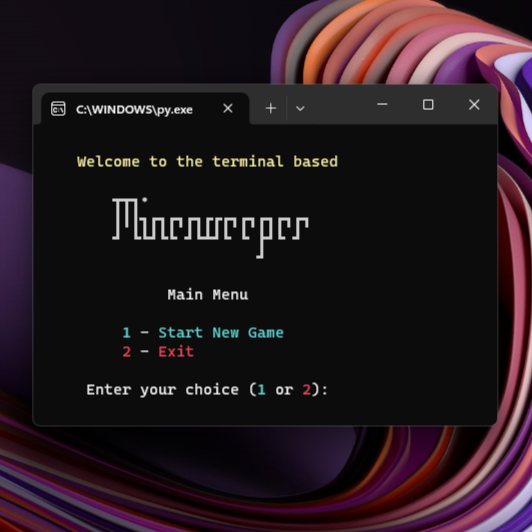
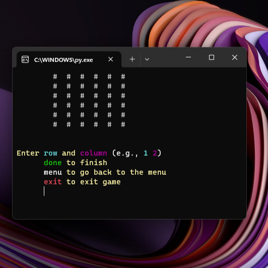

# :bomb: TERMINAL BASED PYTHON MINESWEEPER :bomb:


### :wave: Welcome to Terminal Minesweeper!

This is a terminal-based Python implementation of the classic game Minesweeper, allowing the user to change the difficulty of the game by modifying the parameters.

The game provides a simple yet engaging terminal-based experience. Uncover the mines and clear the minefield to win the game. Customize the difficulty by adjusting the size of the grid and the number of mines.

## :star: Features

- **Random Map Generation:** Creates a new and unique map every game.
- **Customizable Grid:** Choose the size of the Minesweeper grid (1 to 30).
- **Adjustable Difficulty:** Set the number of mines (1 to 25% of the available positions).
- **Interactive Gameplay:** Uncover cells, avoid mines, and win the game.

## :rocket: Getting Started

1. Clone the repository.
   ```bash
   git clone https://github.com/KValentiin/minesweeper.git
   cd minesweeper
    ```

2. Run the Minesweeper game.

    ```bash
    python minesweeper.py
    ```

Follow the on-screen instructions to start a new game, uncover cells, and enjoy the classic Minesweeper experience.

## :video_game: Gameplay

Use row and column numbers to uncover cells (e.g., 1 2).
Enter done to finish the game and check if you've cleared the minefield.
Enter menu to return to the main menu.
Enter exit to exit the game.

## :framed_picture: Screenshots

 

## 	:page_facing_up: License

This project is licensed under the MIT License - see the LICENSE file for details.

## :fax: Contact
Have questions or suggestions? Feel free to reach out:

[Email](kvalentin95@gmail.com)  
[LinkedIn](https://www.linkedin.com/in/valentin-kalanyos-00a245199/)


## :pray: Acknowledgments

A special thanks to the developers of [Colorama](https://pypi.org/project/colorama/), a Python library that makes terminal text styling and coloring easy. The vibrant colors in this Minesweeper game are powered by Colorama, enhancing the overall user experience.

Colorama: © 2011 Jonathan Hartley, licensed under the BSD 3-Clause License. Check out the Colorama documentation for more information on this fantastic library.
